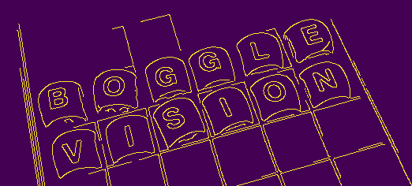

# Boggle Vision

This is my attempt at creating a Boggle solver; unlike other ones, though, this will use computer vision algorithms to detect the board from a picture. 

The `boggle-vision-prototyping` folder contains a lot of my initial code re: prototyping the app. In the `boggle-vision-app` folder, you'll find the actual code for the application. 

